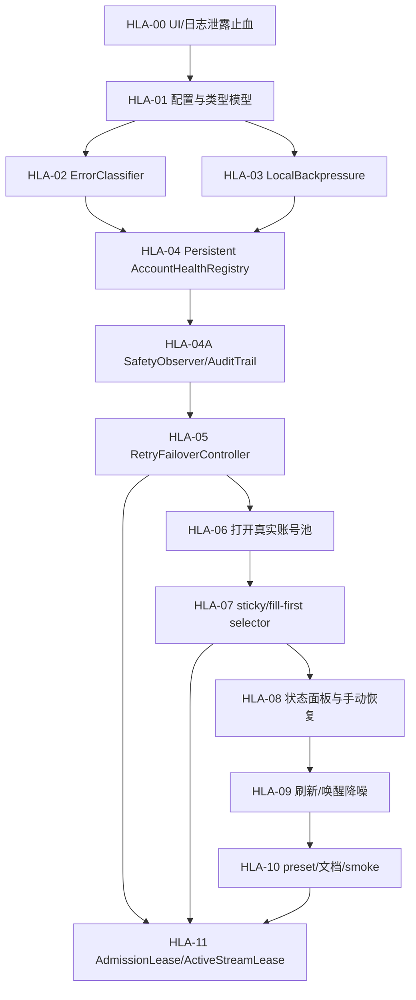

# Cockpit-Tools-Local 自用 Hardened API Mode 实施计划

更新时间：2026-05-18

## 目标与边界

本计划承接 `docs/LOCAL_HARDENED_API_ROADMAP.md` 和 `docs/reference-gateway-best-practices.md`。当前落点是 `src-tauri/src/modules/codex_local_access.rs` 驱动的本机 Cockpit API Service；目标归宿是一个默认保守、低并发、可观察、可回滚的自用 Hardened Local API Mode。

不做事项保持不变：不做公网/LAN 网关，不做请求级随机扫号，不把 LiteLLM/New API/Sub2API/CLIProxyAPI 变成强依赖，不把 500+ free 账号池当作高频自动刷新对象。

本地参考源：`D:\CODE\external\_reference_gateway_sources` 保存 `CLIProxyAPI`、`litellm`、`new-api`、`sub2api` 的源码快照。改动 retry/fallback、health registry、audit trail、selector、stream guard 或路线图时，优先参考该目录和 `docs/reference-gateway-best-practices.md`，再决定是否需要外部资料。

## 审查结论固化

### Cockpit 当前代码事实

- API service 核心入口在 `src-tauri/src/modules/codex_local_access.rs`，配置模型在 `src-tauri/src/models/codex_local_access.rs` 和 `src/types/codexLocalAccess.ts`。
- 后端监听常量已固定为 `127.0.0.1`，但 UI 仍展示 `lanBaseUrl`、`本机/局域网`、`监听本机与局域网` 等口径。
- 实际调度池仍是单账号：`build_effective_local_access_account_ids()` 对 `account_ids` 执行 `take(1)`，`sanitize_collection()` 在第一个有效账号后 `break`，单测 `effective_local_access_pool_is_single_account` 固化了该事实。
- 代理循环已经有多账号雏形、response affinity、model cooldown 和 retry 结构，但由于有效池被裁剪为 1 个账号，多账号排序和 fallback 目前不是完整能力。
- 429 cooldown 只从 `usage_limit_reached` body 中解析 `resets_at` / `resets_in_seconds`，还没有读取 `Retry-After` / `Retry-After-Ms` header。
- model cooldown 只在内存 `GatewayRuntime.model_cooldowns` 中，应用重启后会丢失。
- 没有全局 semaphore、请求启动间隔 limiter、最大排队等待和请求级 timeout 配置模型。
- `MAX_HTTP_REQUEST_BYTES = 64 MiB`、`REQUEST_READ_TIMEOUT = 15s`、`MAX_REQUEST_RETRY_ATTEMPTS = 1`、`UPSTREAM_SEND_RETRY_ATTEMPTS = 3` 等仍是代码常量；hardened preset 需要显式决定哪些暴露为配置，哪些保留内部上限。
- 后端 bind host 是 `127.0.0.1`，但 `snapshot_local_access_state()` 仍会返回按 LAN IPv4 推导的 `lan_base_url`；hardened UI 必须把它当兼容字段而非默认入口。
- 401 会尝试刷新并重试，但没有持久化的 `auth_suspect` / `manual_required` 账号状态。
- `CodexLocalAccessModal` 在 API key 隐藏时仍把完整 key 放入 DOM `title`，需要先修。
- `CodexAccountsPage` 的 inline API service 卡片也会在隐藏 key 时把完整 key 放入 DOM `title`，需要和 modal 同步修。
- 失败日志经 `logger::sanitize_message()` 会做邮箱脱敏，但 `log_codex_api_failure()` 仍传入 raw `account_id`、raw upstream detail 和部分含邮箱拼接消息；需要改成结构化 error type 与 account hash/alias。
- usage stats 记录 `account_id` 和 email，属于本机状态可接受范围，但导出、日志和 UI 展示必须明确区分，不可把 stats 当作可外发审计日志。
- 成功 upstream response 进入 `write_gateway_response()` 后会向下游写 headers/chunks；一旦写出，当前请求只能完成或失败，不能再换账号续接。

### 外部项目可迁移实践

- New API 证明“重试/禁用 channel”应配置化，但其默认 `RetryTimes = 0`、自动禁用关闭，不支持把它解读成默认激进 fallback。
- Sub2API 最值得借鉴的是 `IsSchedulable()` 一等状态判断、持久化 rate limit reset、temp unschedulable、sticky 清理和账号健康面板；不应搬 DB/Redis/scheduler 的重量。
- CLIProxyAPI 最值得借鉴的是 `fill-first`、`Session_id` 粘性、model cooldown error 携带 `Retry-After`、以及“首字节后不再重试/切号”的流式边界。
- LiteLLM 最值得借鉴的是 cooldown 决策矩阵、header cooldown 优先级、pre-call RPM/TPM/parallel checks 和本地 429 `retry-after`；不应引入整个平台级 router。
- 所有参考项目也都有不宜照搬的面：New API 和 CLIProxyAPI 默认更偏平台/多凭据 retry，Sub2API 带 DB/Redis/scheduler 重量，LiteLLM 是完整 proxy 平台；Cockpit 只吸收可本地文件化、可低频运行、可手动恢复的部分。

## 实施原则

1. 先补安全护栏，再打开多账号池。
2. 先新增可测试的纯逻辑模块，再接入长函数热路径。
3. 所有重试和切号必须经过同一个 `ErrorClassifier`。
4. multi-account 保存和调度不得先于 persistent health registry 与 backpressure。
5. 流式响应一旦开始向客户端写出 payload，当前请求禁止切号续接。
6. 用户可见状态只显示 alias/hash/count/status，不显示 token、完整 key、完整邮箱、prompt、response。
7. 风控监察以被动事件和低频健康快照为主，不做主动扫号、伪装探测或以规避平台识别为目标的逻辑。
8. 每个 slice 都可单独回滚，且完成后系统仍可运行。

## 单号池实跑闸门

功能面可以先完成多号池、sticky/fill-first 和有限 fallback；运行面必须 staged rollout。多号池实跑只能在单号池 API service smoke 通过后继续。单号池 smoke 的当前归宿是 `scripts/smoke-local-hardened-api.ps1 -Stage single`，默认只验证本机 loopback、API key guard、`/v1/models`、单账号 hardened 配置、health registry 摘要和 audit tail 摘要；不改 live Codex provider，不调用真实上游，不保存 API key。若桌面端未启用 API service，可加 `-StartEphemeralGateway`，脚本会用同一套 Rust gateway 代码短暂拉起本地服务，跑完停止并还原 `codex_local_access.json`。当前真实上游 smoke 默认用 `gpt-5.4`，该模型已实跑到 429/cooldown/audit 链路；`gpt-5.1-codex-max` 在当前 chat/completions adapter 下返回无体 400，不能作为 429 链路默认探针。

阶段顺序：

1. `single`：账号池恰好 1 个账号，`maxRetryAccounts = 1`。
2. `small_pool`：账号池 2-3 个账号，但仍保持 `maxRetryAccounts = 1`，只验证 selector/sticky/health 不乱轮换。
3. `fallback_probe`：账号池 2-3 个账号，`fallbackMode = next_request_only` 且 `maxRetryAccounts = 2`，只验证有限 fallback 边界。

显式传入 `-RunUpstreamSmoke` 后才发起一次真实 `/v1/chat/completions`。若真实请求返回 429，验收重点不是“马上换号”，而是：

- upstream 429 和 local backpressure 的 `error_type` 分层清楚。
- `Retry-After` / reset 字段进入 cooldown。
- `codex_local_access_health.json` 被动写入账号或模型状态。
- `codex_local_access_audit.jsonl` 能串起 listener、selector、classifier、health update、final/stream 边界。
- 单号池仍保持 `maxRetryAccounts = 1`，不扫账号池。

重点与难点：

- 调度算法是重点难点，但它依赖更底层的可调度性判定；先稳定 `AccountHealthRegistry + ErrorClassifier + RetryFailoverController`，再扩展 sticky/session/fill-first。
- 429 分类难点在于区分 `rate_limit`、`usage_limit_reached`、`insufficient_quota`、`model_capacity` 和本地 backpressure，不能只看 HTTP status。
- stream guard 难点在于 headers 或首个 chunk 写出后不能切账号续接，只能结束当前请求并记录证据。
- health registry 难点在于持久化和 fail-closed；状态损坏时不能默认打开全部账号。
- audit trail 难点在于能回放关键阶段，但不能泄露 prompt、response、token、完整邮箱或 raw upstream body。
- Codex CLI 直连难点在于验证时不能破坏 live Codex provider/history；必须用临时配置或脚本化隔离。

参考方向：

- 官方 OpenAI API error docs 把 429 分成请求速率过快和额度/预算耗尽，并建议 pacing/backoff、尊重 response headers；503/overload 要保持稳定低速率后再逐步恢复。
- Sub2API 的 `IsSchedulable()`、持久化 rate-limit reset、temp unschedulable 和 sticky 清理，是 Cockpit 账号健康状态机的主要参考。
- CLIProxyAPI 的 fill-first/session affinity、model cooldown `Retry-After` 和首字节后不重试，是 Cockpit 默认自用调度和 stream guard 的主要参考。
- LiteLLM 的 pre-call rate checks、本地 429 `retry-after` 与 cooldown 决策矩阵，适合作为 Cockpit local backpressure 的参考。
- New API 的 channel retry/disable 配置化思路可借鉴，但 weighted/random request-level routing 不进入 hardened 默认。

## 依赖顺序



## 任务清单

### HLA-00 UI/日志泄露止血

描述：先修低风险但高敏感度的问题，避免在后续调试中继续暴露完整 key、raw upstream detail 或误导性 LAN 文案。

状态：已实现（2026-05-17）。已完成静态检查、前端 typecheck、Rust 全量测试；尚未启动桌面 UI 做 live DOM/log tail smoke。

验收：

- [x] API key 隐藏状态下 DOM `title` 不包含完整 key，复制按钮仍可复制。
- [x] API service 卡片和 modal 默认文案改为“仅本机”。
- [x] `localAccessAddressKind = "lan"` 的旧持久化偏好在 hardened mode 下会自动回落到 `local` 展示。
- [x] `lanBaseUrl` 仍可作为旧状态兼容字段返回，但 hardened 默认 UI 不展示 LAN 选项。
- [x] 失败日志只输出 `error_type`、status、route、model、latency、account hash/alias、request id。
- [x] 脱敏回归覆盖 `Authorization`、API key、OAuth token、完整邮箱、raw upstream body 和含 prompt/response 字样的错误文本。

验证：

- [x] `npm run typecheck`
- [x] `cargo test --package cockpit-tools --quiet`
- [x] `cargo test --package cockpit-tools --quiet -- --test-threads=1`
- [x] `cargo fmt --check`
- [x] `git diff --check`
- [x] 静态扫描：`title={collection.apiKey}`、`title={localAccessCollection?.apiKey`、`本机/局域网`、`监听本机与局域网`、`Local/LAN`、`Listens on local and LAN` 在 HLA-00 相关 UI/locale 文件中无命中。
- [ ] 手动检查 UI DOM title 和日志 tail。

可能文件：

- `src/components/CodexLocalAccessModal.tsx`
- `src/pages/CodexAccountsPage.tsx`
- `src/locales/zh-CN.json`
- `src/locales/en.json`
- `src-tauri/src/modules/codex_local_access.rs`
- `src-tauri/src/modules/logger.rs`

依赖：无。

### HLA-01 配置与类型模型

描述：新增 `LocalApiSafetyConfig`，只做模型、默认值、读写迁移和状态回显，暂不改变调度行为。

状态：已实现（2026-05-17）。已新增 Rust/TS 配置合同、旧配置兼容迁移、未来 schema fail-closed 归一化；当前只回显配置，不改变请求调度热路径。

验收：

- [x] 旧 `codex_local_access.json` 缺字段时自动补安全默认值。
- [x] Rust model 与 TS type 字段一致。
- [x] `hardenedLocalMode` 默认 `true`。
- [x] 配置包含 `schemaVersion`，未来字段迁移能 fail-closed。
- [x] 配置状态能回显 `maxConcurrentRequests`、`minRequestIntervalSeconds`、`maxQueueWaitSeconds`、`requestTimeoutSeconds`、`maxRequestBodyMb`、`maxRetries`、`maxRetryAccounts`、`fallbackMode`、`logging`。
- [x] 当前硬编码常量要么迁入配置默认值，要么在代码旁标注为不可放宽内部上限并加入测试。

验证：

- [x] `cargo test --package cockpit-tools local_api_safety_config --quiet`
- [x] `cargo test --package cockpit-tools --quiet`
- [x] `npm run typecheck`
- [x] `cargo fmt --check`
- [x] `git diff --check`

可能文件：

- `src-tauri/src/models/codex_local_access.rs`
- `src-tauri/src/modules/codex_local_access.rs`
- `src/types/codexLocalAccess.ts`

依赖：HLA-00 可并行，但推荐先完成 HLA-00。

### HLA-02 ErrorClassifier

描述：抽出 `ErrorClassifier`，统一解析 HTTP status、headers、body、OpenAI/Codex provider fields，并产出结构化错误。

状态：2026-05-17 已完成本 slice。实现落点仍在 `src-tauri/src/modules/codex_local_access.rs`，后续复杂度增加时再拆 `codex_local_access_classifier.rs`。当前只收紧单账号/请求级安全边界，不打开真实多账号池。

验收：

- [x] `Retry-After` 秒数和 HTTP-date 均可解析。
- [x] `Retry-After-Ms` 可解析，且优先级高于 `Retry-After` 和 body reset。
- [x] `usage_limit_reached.resets_at` / `resets_in_seconds` 可解析。
- [x] `insufficient_quota`、`quota exceeded`、`selected model is at capacity` 分类清晰。
- [x] 401/403/captcha/suspicious 进入保守分类，不触发请求级扫号。
- [x] 未知 429 只产生上游限流分类和可选 cooldown，不触发跨账号扫射。
- [x] `ClassifiedError` 至少包含 `source`、`scope`、`status`、`provider_code`、`retry_after`、`manual_required`、`safe_message`、`log_fields`。
- [x] `upstream_rate_limit`、`usage_limit_reached`、`auth_error`、`captcha_or_suspicious`、`insufficient_quota`、`model_capacity`、`network_error`、`server_error` 分开处理；`local_rate_limit` 留到 HLA-03 本地 backpressure 接入。
- [x] raw body 不直接进入日志或 `safe_message`。

验证：

- [x] classifier 单测覆盖 header/body/status 组合。
- [x] `cargo test --package cockpit-tools classifier --quiet`
- [x] `cargo test --package cockpit-tools retry_after --quiet`
- [x] `cargo test --package cockpit-tools --quiet`
- [x] `npm run typecheck`

可能文件：

- `src-tauri/src/modules/codex_local_access.rs`
- 后续可拆到 `src-tauri/src/modules/codex_local_access_classifier.rs`

依赖：HLA-01。

### HLA-03 LocalBackpressure

描述：在进入上游前增加本地 backpressure：global semaphore、请求启动间隔、bounded queue、请求超时。

状态：2026-05-18 已完成本地背压切片。当前实现仍保持单账号保守路径，不打开多账号池；stream guard 的“已写出后不跨账号续接”继续归入 HLA-05。2026-05-19 修复 Codex CLI 快速连续请求下的本地 429：`maxQueueWaitSeconds` 默认和配置规范化都会覆盖 `minRequestIntervalSeconds + 1s`，避免 20 秒启动间隔只排队 10 秒后误报 `exceeded retry limit`。

验收：

- [x] hardened 默认同一时间最多 1 个上游请求。
- [x] 新请求启动默认至少间隔 20 秒。
- [x] 本地排队等待默认覆盖启动间隔；旧配置 `maxQueueWaitSeconds < minRequestIntervalSeconds + 1` 会在加载时自动规范化。
- [x] 等待超时返回本地 429/503，并带 `Retry-After`。
- [x] 本地 backpressure 返回的错误使用 `error_type = local_backpressure` 或等价结构，不能伪装成 upstream quota。
- [x] streaming 成功、客户端断开、上游异常都会通过 scoped permit drop 释放 permit；HLA-05 继续覆盖 stream 已写出后的禁止重试/切号。
- [x] `/v1/models` 不占用上游请求 permit。

验证：

- [x] 并发请求单测：`cargo test --package cockpit-tools local_backpressure --quiet`
- [x] queue wait 规范化单测：`cargo test --manifest-path .\src-tauri\Cargo.toml --target-dir .\target normalizes_queue_wait_to_cover_start_interval --quiet`
- [x] permit drop 释放单测：`cargo test --package cockpit-tools local_backpressure --quiet`
- [x] `cargo test --package cockpit-tools --quiet`
- [x] `cargo test --package cockpit-tools --quiet -- --test-threads=1`
- [x] `npm run typecheck`
- [x] `cargo fmt --package cockpit-tools --check`
- [x] `git diff --check`

可能文件：

- `src-tauri/src/modules/codex_local_access.rs`
- 后续可拆到 `src-tauri/src/modules/codex_local_access_backpressure.rs`

依赖：HLA-01。

### HLA-04 Persistent AccountHealthRegistry

描述：新增 API service 专用运行态文件，不污染原始账号凭据；记录账号/模型 cooldown、auth suspect、manual required 和最近错误。

状态：2026-05-18 已完成基础持久化切片：新增 health registry schema、原子写入、损坏 fail-closed、上游错误分类到健康状态、真实请求入口加载健康状态并跳过不可调度账号。手动清除和 UI 状态面板继续归入 HLA-08。

建议文件：

- `codex_local_access_health.json`

建议顶层结构：

- `schema_version`
- `updated_at`
- `accounts`
- `model_cooldowns`
- `sticky_bindings`
- `last_global_error`

验收：

- [x] 429 cooldown 重启后仍生效。
- [x] 401/403/captcha/suspicious 重启后仍需人工确认。
- [ ] 用户可手动清除某个账号/模型状态。
- [x] 状态文件不保存 prompt、response、token、cookie、完整 API key。
- [x] 状态文件使用原子写入，损坏时 fail-closed 并提示用户，而不是悄悄打开全部账号调度。
- [x] health registry 是 API service 运行态，不反向覆盖 Cockpit 账号中心里的 OAuth/API Key 凭据。

验证：

- [x] health registry serde/fail-closed 单测：`cargo test --package cockpit-tools health_registry --quiet`
- [x] cooldown 持久化单测：`cargo test --package cockpit-tools health_registry --quiet`
- [x] unknown 429 不判定 exhausted 单测：`cargo test --package cockpit-tools health_registry --quiet`

可能文件：

- `src-tauri/src/models/codex_local_access.rs`
- `src-tauri/src/modules/codex_local_access.rs`
- 后续可拆到 `src-tauri/src/modules/codex_local_access_health.rs`

依赖：HLA-02、HLA-03。

### HLA-04A SafetyObserver/AuditTrail

描述：在 API service 内部加入被动监察层，记录风控相关关键节点的脱敏事件；不新增独立常驻探测进程，不通过额外请求判断额度，不设计规避官方识别的策略。

状态：2026-05-18 已完成首个运行路径切片：新增本地 JSONL audit trail、结构化脱敏事件、大小轮转，并接入真实请求的 listener、selector、classifier、health update、stream write/final response 边界。2026-05-19 补齐当前 Rust runtime path 的 `auth_projection` 与 `upstream_forward` 细分事件，并新增按事件日轮转、audit 写入/解析失败 degraded 状态、健康摘要/UI 降级提示。

事件来源：

- 服务监听：request accepted、route、model、method、request_id。
- 认证投影：current account source、account alias/hash、prepare/refresh decision，不记录 token/cookie；当前已记录 `prepared`、`prepare_failed`、`refreshed`。
- 上游转发：route、model、stream flag、request_id、account alias/hash、status；当前已记录 send start、response received、send failure 和 refresh 后重发边界。
- 429/401/403/captcha/suspicious 分类：`error_type`、source、scope、manual required、retry-after。
- selector 排序：chosen account hash；candidate count、skipped reason 和 sticky binding reason 后续补齐。
- stream 写出：headers_written、first_chunk_written、finish/upstream_error。
- Codex CLI 直连 smoke：仅记录本地 loopback 探针结果和状态码，不记录 prompt/response。

验收：

- [x] audit trail 只保存结构化元数据，不保存 prompt、response、messages、token、cookie、Authorization、完整邮箱、完整 API key、raw upstream body。
- [x] 额度为零只通过真实业务请求返回的明确 quota/exhaustion 信号或人工标记确认；未知 429 只标为 rate limit/cooldown，不直接判定 exhausted。
- [x] 监察逻辑不发起额外上游请求，不批量刷新 500+ 账号，不通过高频探测等待恢复。
- [x] 每个 request_id 可串起当前 runtime path：listener -> auth projection -> selector -> upstream -> classifier/health update -> stream write/final response。已覆盖 listener、auth projection、selector、upstream forward、classifier、health update、stream write/final response；health update 仅在真实 429/401/403/cooldown 等触发更新时出现。
- [x] audit 文件采用大小/天数轮转；写入或解析轮转状态失败时不影响 API service 请求路径，健康摘要和 UI 明确提示 audit degraded。
- [ ] UI 只展示聚合状态和最近脱敏事件，默认不展开账号级细节。

验证：

- [x] audit event serde/redaction 单测：`cargo test --package cockpit-tools audit_event --quiet`
- [x] quota exhausted vs unknown 429 分类审计单测：`cargo test --package cockpit-tools classifier --quiet`、`cargo test --package cockpit-tools health_registry --quiet`
- [x] stream headers/first chunk 审计边界单测：`cargo test --package cockpit-tools audit_event --quiet`
- [x] request_id audit chain smoke：`.\scripts\smoke-local-hardened-api.ps1 -Stage small_pool -RunUpstreamSmoke -WriteReport -StartEphemeralGateway`，证据 `reports/local-hardened-api-smoke/smoke-20260519-000145.json`，audit phases 包含 `auth_projection` 与 `upstream_forward`，overall `pass`。
- [x] audit day rotation / degraded summary 单测：`cargo test --manifest-path .\src-tauri\Cargo.toml --target-dir .\target audit --quiet`
- [x] audit degraded UI 类型契约：`npm run typecheck`
- [x] 3 账号 small_pool ephemeral gateway：`reports/local-hardened-api-smoke/smoke-20260519-001635.json`，overall `pass`，audit phases 包含 `auth_projection` 与 `upstream_forward`，`hasSensitiveMarkers=false`。
- [x] 3 账号 fallback_probe ephemeral gateway：`reports/local-hardened-api-smoke/smoke-20260519-001658.json`，overall `pass`，`fallbackMode=next_request_only`，`maxRetryAccounts=2`。
- [x] `git diff --check`

建议文件：

- `codex_local_access_audit.jsonl`
- 后续可拆到 `src-tauri/src/modules/codex_local_access_audit.rs`

依赖：HLA-02、HLA-03、HLA-04。

### HLA-05 RetryFailoverController

描述：把 retry、cooldown、single-account retry、next-account fallback、stream guard 统一到一个控制器。

状态：2026-05-18 已完成首个控制器边界切片：`maxRetries` 进入单账号状态重试和请求级冷却等待重试，`maxRetryAccounts` + `fallbackMode` 进入有效账号尝试上限，默认仍只尝试 1 个账号；新增 stream write state，headers 或首个 chunk 写出后禁止 fallback 的契约已单测固化。完整 `RetryFailoverController` 类型拆分、client disconnect 分类和 UI 高级开关继续留在后续切片。

验收：

- [x] 默认 `maxRetries = 1`。
- [x] 默认 `maxRetryAccounts = 1` 表示一个请求最多使用 1 个 distinct account，不扫完整账号池。
- [x] 只有在未向客户端写出 headers 和 payload 前才允许 fallback。
- [x] 首字节后上游错误只结束当前请求，不切号续接。当前由 stream write state 和写出路径约束；client disconnect 细分日志待补。
- [x] local 429 与 upstream 429 的 `error_type` 不同。

验证：

- [x] stream-first-byte guard 单测：`cargo test --package cockpit-tools stream_write_state --quiet`
- [x] fallback cap 单测：`cargo test --package cockpit-tools retry_failover --quiet`
- [x] local/upstream 429 response 单测：`cargo test --package cockpit-tools local_backpressure --quiet`、`cargo test --package cockpit-tools classifier --quiet`

可能文件：

- `src-tauri/src/modules/codex_local_access.rs`
- 后续可拆到 `src-tauri/src/modules/codex_local_access_failover.rs`

依赖：HLA-02、HLA-04、HLA-04A。

### HLA-06 打开真实账号池

描述：在护栏完成后，移除 `take(1)` / `break` 裁剪，保存用户选择的多个有效账号。

状态：2026-05-18 已完成数据面切片：UI 可多选，保存/规范化层保留多个有效账号并去重过滤无效账号；请求选择器可看到完整账号池，但实际上游尝试仍受 HLA-05 的 `maxRetryAccounts` 与 `fallbackMode` 控制，默认一个请求只尝试 1 个账号，不提升并发或缩短请求间隔。500+ selector cap 与 sticky/fill-first 默认路由已在 HLA-07 落地。

验收：

- [x] `account_ids` 可保存多个有效账号。
- [x] 请求选择器使用完整账号候选池，健康过滤后只尝试当前 cap 允许的账号数；projection 仍按安全 cap 取单账号写入。
- [x] 旧单账号配置无缝迁移。
- [x] 多账号池不会自动提高并发或缩短请求间隔。
- [x] 现有单账号池单测必须被改写为“旧配置默认单账号安全迁移”和“多账号需依赖 health registry”的新契约，不能直接删除无替代证据。
- [x] 500+ fake accounts 测试覆盖 selector 候选池和一次请求最多尝试账号数。

验证：

- [x] `sanitize_collection()` 多账号保存单测：`cargo test --package cockpit-tools local_access_account_filter --quiet`
- [x] 旧配置迁移单测：`cargo test --package cockpit-tools effective_local_access_pool --quiet`
- [x] 500+ fake accounts selector cap 单测：`cargo test --package cockpit-tools hardened_routing --quiet`

可能文件：

- `src-tauri/src/modules/codex_local_access.rs`
- `src/components/CodexLocalAccessModal.tsx`

依赖：HLA-04、HLA-05。

### HLA-07 sticky/fill-first selector

描述：把当前 round-robin cursor 改成 hardened 默认的 sticky/fill-first selector。

状态：2026-05-18 已完成核心选择器切片：hardened mode 下请求起点固定为 0，不再随每个请求推进 round-robin cursor；候选池保留完整账号列表，实际上游尝试仍受 `maxRetryAccounts` / `fallbackMode` cap 控制；默认 fill-first 保持用户排序并跳过会触发账号快照刷新的 plan/quota 排序；process sticky binding 写入 health registry，健康时置顶，cooldown/auth/manual/过期/失效时清理或绕过；`previous_response_id` affinity 仍在最后置顶。`Session_id` / `X-Client-Request-Id` 作为后续任务级扩展保留。

策略：

- `sticky_process`：AI 推荐。默认固定进程级账号，账号不可调度时才 fallback。
- `fill_first`：适合 quota drain careful，按用户排序用第一个健康账号。
- `balanced_low_rate`：仅手动 opt-in，低频分散请求。
- `round_robin`：仅保留显式高级选项，不进入 hardened 默认。

验收：

- [x] `previous_response_id` affinity 优先。
- [ ] `Session_id` / `X-Client-Request-Id` 可作为后续扩展来源。
- [x] 当前账号 healthy 时不会请求级轮换。
- [x] cooldown/auth/manual 状态会清理或绕过粘性绑定。

验证：

- [x] sticky_process 单测：`cargo test --package cockpit-tools hardened_routing --quiet`
- [x] fill_first 单测：`cargo test --package cockpit-tools hardened_routing --quiet`
- [x] cooldown clears sticky 单测：`cargo test --package cockpit-tools hardened_routing --quiet`
- [x] 500+ selector cap 单测：`cargo test --package cockpit-tools hardened_routing --quiet`

可能文件：

- `src-tauri/src/modules/codex_local_access.rs`

依赖：HLA-06。

### HLA-08 状态面板与手动恢复

描述：UI 展示 API service 健康状态，并提供手动恢复/暂停，不展示敏感内容。

状态：2026-05-18 已完成只读可观测性与手动恢复切片：`CodexLocalAccessState.health` 暴露脱敏 health summary，包含 healthy/cooling/auth/manual/model cooldown 计数、sticky account hash、最近错误类型和最近 cooldown 到期时间；API 服务面板展示这些字段。`codex_local_access_recover_health` 仅在用户显式点击时本地清理单账号或当前模型 cooldown，写入脱敏 audit event，不发起上游请求、不刷新额度、不展示账号 ID/邮箱。手动暂停仍留到后续切片。

验收：

- [x] 展示当前 sticky account hash。
- [x] 展示 healthy/cooling/auth_failed/manual_required 数量。
- [x] 展示最近错误类型和 cooldown 到期时间。
- [x] 可手动恢复单账号或单模型 cooldown。
- [x] health/recovery 面板不展示完整邮箱、完整 key、token、prompt、response。

验证：

- [x] health summary 脱敏单测：`cargo test --package cockpit-tools health_summary --quiet`
- [x] 手动恢复单测：`cargo test --package cockpit-tools manual_recovery --quiet`
- [x] `npm run typecheck`
- [ ] 手动 UI smoke。

可能文件：

- `src/components/CodexLocalAccessModal.tsx`
- `src/pages/CodexAccountsPage.tsx`
- `src/types/codexLocalAccess.ts`

依赖：HLA-04、HLA-04A、HLA-07。

### HLA-09 刷新/唤醒降噪

描述：hardened mode 下把配额刷新、quota reset wakeup、startup wakeup 统一纳入低频和显式 opt-in 规则。

状态：2026-05-18 已完成首个前端策略切片：`useAutoRefresh` 不再因 quota reset wakeup 自动把全局刷新间隔改为 2 分钟；Codex 自动刷新不再读取 API service OAuth 账号池做批量探测，只保留 API key 类账号刷新，且超过 50 个目标时跳过；后台唤醒总开关开启前增加风险确认。后续仍需补 backend wakeup/reset 单测或 smoke。

验收：

- [x] 默认不批量刷新 500+ 账号。
- [x] cooldown 账号不通过高频刷新探测恢复。
- [x] quota reset wakeup 不自动把全局刷新间隔调到高频。
- [x] 启用后台唤醒前有清晰风险提示。

验证：

- [ ] wakeup/reset 相关单测或轻量 smoke。
- [ ] `npm run typecheck`

可能文件：

- `src/hooks/useAutoRefresh.ts`
- `src/components/codex/CodexWakeupContent.tsx`
- `src-tauri/src/modules/codex_wakeup.rs`
- `src-tauri/src/modules/codex_wakeup_scheduler.rs`

依赖：HLA-08。

### HLA-10 preset/文档/smoke

描述：把 hardened defaults、balanced self-use、quota drain careful 做成可恢复 preset，并补最终用户文档。

状态：2026-05-18 已完成文档契约、UI/command preset 与单号池 smoke harness 切片：新增 `docs/LOCAL_HARDENED_API.md`，写明默认安全姿态、三类 preset 目标值、单号池实跑、Codex CLI 直连 Cockpit、可选 LiteLLM 桥接、风险边界和回滚；`codex_local_access_apply_safety_preset` 与 API 服务面板策略预设按钮已可恢复 `maximum_safety`、`balanced_self_use`、`quota_drain_careful`；`scripts/smoke-local-hardened-api.ps1` 已提供默认不耗上游额度的 preflight、短生命周期 gateway runner 和显式真实上游 smoke。单号池实跑发现 health registry model cooldown 只阻断调度但未返回 wait，导致重复请求短路为 503；已改为从 health registry 提取 cooldown wait，重复请求返回本地 429 + `Retry-After`。2026-05-19 已用临时 free 账号、ephemeral gateway 和 `codex exec --ephemeral` 完成 CLI direct smoke。

验收：

- [x] `maximum_safety` 展开为单账号、单并发、60 秒间隔、manual fallback。
- [x] `balanced_self_use` 展开为单并发、20-30 秒间隔、sticky then next healthy。
- [x] `quota_drain_careful` 展开为 fill-first、严格 cooldown、低速率。
- [x] 文档写明 Codex CLI 直连 Cockpit 和可选 LiteLLM 桥接两条路径。
- [x] UI/command 级一键恢复 preset。
- [x] 单号池/小池/fallback 分阶段 smoke harness 不改 live Codex provider，默认不调用真实上游。
- [x] 关闭 LiteLLM 后 Codex CLI 仍可直连 Cockpit；证据 `reports/local-hardened-api-smoke/codex-cli-direct-smoke-20260519-002837.json`。

验证：

- [x] `npm run typecheck`
- [x] `npm run build`
- [x] `cargo test --package cockpit-tools safety_preset`
- [x] `node scripts/check_locales.cjs`
- [x] `.\scripts\smoke-local-hardened-api.ps1 -Stage single -StartEphemeralGateway -WriteReport`
- [x] `.\scripts\smoke-local-hardened-api.ps1 -Stage single -StartEphemeralGateway -RunUpstreamSmoke -Expect429 -Model gpt-5.4 -WriteReport`
- [x] `cargo test --manifest-path .\src-tauri\Cargo.toml --target-dir .\target health_registry_model_cooldown_wait_is_exposed_for_scheduler --quiet`
- [ ] `.\scripts\smoke-local-hardened-api.ps1 -Stage small_pool -WriteReport`
- [ ] `.\scripts\smoke-local-hardened-api.ps1 -Stage fallback_probe -RunUpstreamSmoke -WriteReport`
- [x] 手动 smoke：Codex CLI 使用当前 API service 端口 `http://127.0.0.1:45335/v1`，一次性 provider `cockpit_direct_smoke`，`codex exec --ephemeral` 返回 `OK`。
- [ ] 2026-05-18 前置探针：`Test-NetConnection 127.0.0.1:2876` 返回未监听；未修改 live Codex provider/API key。

可能文件：

- `docs/LOCAL_HARDENED_API.md`
- `docs/LOCAL_HARDENED_API_ROADMAP.md`
- `docs/reference-gateway-best-practices.md`
- `src/components/CodexLocalAccessModal.tsx`

依赖：HLA-09。

### HLA-11 AdmissionLease/ActiveStreamLease

描述：把“已被上游接纳的 stream/response 继续跑完”和“新的 admission 才避开 cooldown/exhausted 账号”固化为 API service 运行时边界。该切片不模拟上游 quota grace，不绕过真实 pre-stream 429，不做 mid-stream 跨账号续接；只保证本地 health registry、cooldown、selector 和 fallback 决策不会 retroactively cancel active stream。

状态：2026-05-18 已完成最小 Rust 切片。已新增 admitted stream lease lifecycle、lease grant/release audit、client abort/terminal error 分类、admission 后释放 backpressure permit、`previous_response_id` strict affinity，以及 small_pool/fallback_probe 实跑证据。HLA-05 既有 headers/first chunk 写出后禁止 fallback 的 stream write state 继续保留。

核心规则：

- `pre-stream 429`：没有 `2xx`、没有有效 SSE 首事件、没有 `response.created`、没有 background `response_id`，视为 admission rejected；标记 cooldown/backoff，按策略返回 429 或在新 admission 层选择健康账号。
- `upstream admitted`：一旦上游已返回 `2xx` 或 stream 出现可判定接纳信号，grant lease；后续本地 cooldown、账号 exhausted 标记和 selection eligibility 变化只影响新 admission，不关闭该 stream。
- `active stream`：不切账号、不跨账号续接，只 pipe 到 terminal event、upstream terminal error、client abort、explicit cancel 或 transport fatal error。
- `new independent request`：不需要等待其他 active stream 完成；可立即避开 cooldown/exhausted 账号，选择健康账号。
- `previous_response_id continuation`：优先粘原账号；不能把原账号的 `previous_response_id` 直接发给新账号。若要 fallback 到新账号，必须走 full context replay 或 compacted replay，并把它视为新 admission，不是严格 continuation。

验收：

- [x] active SSE stream 被 grant lease 后，同账号随后被标记 cooldown/exhausted，stream 仍继续到 terminal 或真实 transport error。
- [x] pre-stream 429 会写入 health/cooldown/audit，但不会影响同账号已有 active lease。
- [x] active stream 期间同账号另一个请求返回 429，不 retroactively cancel active stream。
- [x] new admission 遇到 cooldown/exhausted 账号，会避开或返回本地 429；不等待无关 active stream 结束。
- [x] `previous_response_id` affinity 强绑定原 account hash/route；不会跨账号直接复用旧 `previous_response_id`。
- [x] client abort、upstream terminal error、normal completed 都会 release lease，不泄漏 active count。
- [x] health registry 状态变更只更新 `selection_eligible`，不会直接 cancel active leases。
- [x] 结构化 audit 能区分 `admission_attempt`、`upstream_admitted`、`lease_granted`、`stream_completed`、`stream_error`、`client_aborted`、`lease_released`、`account_cooldown_applied`、`fallback_selected`。
- [x] 不新增高频 refresh、全账号池扫描或 aggressive retry。

验证：

- [x] `cargo test --manifest-path .\src-tauri\Cargo.toml --target-dir .\target active_stream_lease --quiet`
- [x] `cargo test --manifest-path .\src-tauri\Cargo.toml --target-dir .\target hardened_routing --quiet`
- [x] `cargo test --manifest-path .\src-tauri\Cargo.toml --target-dir .\target stream_write_state --quiet`
- [x] `cargo test --manifest-path .\src-tauri\Cargo.toml --target-dir .\target previous_response_affinity --quiet`
- [x] `.\scripts\smoke-local-hardened-api.ps1 -Stage small_pool -RunUpstreamSmoke -WriteReport -StartEphemeralGateway`
- [x] `.\scripts\smoke-local-hardened-api.ps1 -Stage fallback_probe -RunUpstreamSmoke -WriteReport -StartEphemeralGateway`
- [x] `git diff --check`

证据：

- `reports/local-hardened-api-smoke/smoke-20260518-234934.json`：`small_pool` 首轮 contract/loopback/auth pass；真实上游单账号请求 fail 后写入 cooldown/audit，audit phases 包含 `account_cooldown_applied` 与 `fallback_selected`。
- `reports/local-hardened-api-smoke/smoke-20260518-234939.json`：`fallback_probe` 上游实跑 pass，audit phases 包含 `selector` 与 `upstream_admitted`。
- `reports/local-hardened-api-smoke/smoke-20260518-235038.json`：`small_pool` 复跑 pass，证明 health/selector 会避开刚冷却账号且不扩大 `maxRetryAccounts=1`。

可能文件：

- `src-tauri/src/modules/codex_local_access.rs`
- 后续可拆到 `src-tauri/src/modules/codex_local_access_lease.rs`
- `docs/LOCAL_HARDENED_API.md`
- `docs/reference-gateway-best-practices.md`

依赖：HLA-05、HLA-07、HLA-10。已完成本切片与 2-3 账号真实小池、fallback probe 放量；后续不应把 HLA-11 解释为跨账号续接或 quota grace。

## 推荐执行顺序

AI 推荐：HLA-11、当前 runtime path 的 `request_id` audit chain、audit day rotation 与 degraded 可见性已完成后，下一步做 Codex CLI direct smoke 的低风险窗口验证，或继续补 audit UI 最近脱敏事件列表。理由：核心 API service 链路已经有 Rust focused tests 与 ephemeral gateway 实跑，剩余最大未知是 CLI 入口真实接入和 UI 可读性增强。
2026-05-19 补充：Codex CLI direct smoke 已完成。下一步 AI 推荐补 audit UI 最近脱敏事件列表，理由：CLI 入口已被真实 `codex exec` 证明，剩余高收益点是让用户在 UI 中直接看到最近 request_id 链路摘要。

## 完成态证据

每个 slice 至少记录：

- `依据`：本计划中的任务 ID 和相关代码路径。
- `命令`：实际运行的 build/test/typecheck。
- `证据`：命令 exit code、关键输出、必要时 UI 截图或日志 tail。
- `回滚`：对应 commit 或可撤销配置。

docs-only 更新可使用：

```powershell
git diff --check
```

代码更新按风险顺序使用：

```powershell
cargo fmt
cargo test --package cockpit-tools codex_local_access --quiet
cargo test --package cockpit-core
npm run typecheck
npm run build
```
