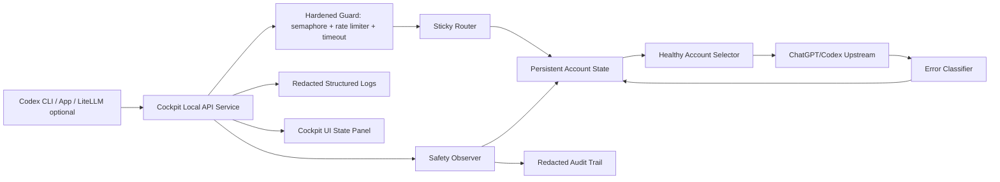

# Cockpit-Tools-Local 自用 Hardened API Mode 路线图

更新时间：2026-05-18

## 目标归宿

当前落点是 Cockpit-Tools-Local 自用版的 Codex API service。目标归宿是在保留现有桌面账号管理、配额展示、Codex App/CLI 投影能力的前提下，把本地 API service 改造成默认保守、可观测、可回滚的 Hardened Local API Mode。

本路线不以公网网关、多用户服务、商业中转或请求级账号扫射为目标。`new-api`、`sub2api`、`CLIProxyAPI`、`LiteLLM` 只作为结构参考，不作为默认架构替代。

本地参考源码优先使用 `D:\CODE\external\_reference_gateway_sources`，其中包含 `CLIProxyAPI`、`litellm`、`new-api`、`sub2api` 快照；参考结论汇总在 `docs/reference-gateway-best-practices.md`。

## 当前判断

直接弃用 Cockpit 并转用其它网关项目，能减少本仓改造工作，但不贴合当前核心需求：

- 其它项目更偏服务端网关、渠道管理、虚拟 key、计费、Docker 部署或通用 LLM router。
- 当前需求更偏本机自用、ChatGPT/Codex OAuth 账号管理、配额可视化、Codex App/CLI 联动、低并发和低刷新。
- 500+ free 账号额度小、耗尽快，关键不是请求级轮询，而是账号状态机、429 熔断、低速率、粘性路由和人工可见性。

推荐路线：

1. 保留 Cockpit-Tools-Local 作为本机控制台和账号真源。
2. 第一阶段先做 Hardened Local API Mode MVP，控制风险和并发。
3. 第二阶段再实现真实多账号池状态机，解决 500+ free 账号的可用性和可观测性。
4. 第三阶段补 UI、策略 preset、测试和文档。
5. 其它网关项目只借鉴成熟做法，或作为可选兼容层。

本次深度审查后的优化结论：

- 先不要直接打开多账号池。当前代码已经有 round-robin cursor、response affinity、model cooldown 和 retry 雏形，但缺 persistent health、header cooldown、全局 backpressure 和 stream guard；先打开多账号会放大 429 连撞和账号风控风险。
- P0 顺序调整为：UI/日志泄露止血 -> hardened 配置模型 -> ErrorClassifier -> LocalBackpressure -> Persistent AccountHealthRegistry -> SafetyObserver/AuditTrail -> RetryFailoverController。
- 多账号保存和调度放到 P1，且必须依赖 `AccountHealthRegistry` 和 `RetryFailoverController` 完成后再移除 `take(1)` / `break`。
- 把当前硬编码常量纳入 P0 设计面：请求体上限、读取超时、上游发送重试、请求级重试等待和 fallback account 上限都要有 hardened 默认、测试和回滚口径。
- 流式响应必须按“下游已写出 headers 或 payload 后禁止重试/切号”建模；不能只在拿到 upstream response 前做 retry 判断。
- 实施级任务清单已下沉到 `docs/LOCAL_HARDENED_API_IMPLEMENTATION_PLAN.md`，本路线图保持方向、阶段和验收口径。

## 已知代码事实

- API service 后端入口主要在 `src-tauri/src/modules/codex_local_access.rs`。
- 后端监听 host 已固定为 `127.0.0.1`，这是一个好的安全基线。
- 后端仍会计算 `lan_base_url` 并回传给 UI；在 hardened 默认下这只是兼容字段，不应作为可用入口展示。
- 当前请求体上限、读取超时、请求重试等待、上游发送重试等仍是代码常量，不在用户可见配置和 preset 中。
- 当前本地 API service 账号池实际只调度 1 个账号：
  - `build_effective_local_access_account_ids()` 对 `account_ids` 执行 `take(1)`。
  - `save_local_access_accounts()` 保存时遇到第一个有效账号后 `break`。
  - `sanitize_collection()` 会把账号集合裁剪为 1 个。
- 当前存在 routing strategy 枚举和排序逻辑，但在 API service 实际单账号池下大多不会发挥多账号排序效果。
- 当前 429 cooldown 只解析 body 中的 `usage_limit_reached` reset 字段，未覆盖 `Retry-After` / `Retry-After-Ms` header。
- 当前 cooldown 保存在运行时内存，重启后会丢失。
- 当前没有 API service 全局 semaphore 和请求启动 rate limiter。
- 当前没有 hardened local API 配置结构；Rust model 和 TS type 只有端口、API key、路由策略、free 限制、follow current 和账号列表。
- 当前 401 会尝试刷新并重试，但没有持久化的 `auth_suspect` / `manual_required` 账号状态。
- 当前成功 upstream response 会交给写出函数流式转发；一旦下游响应头或首个 chunk 已写出，本请求就不再具备安全切号空间。
- Codex 配额自动刷新默认值是 `-1`，即默认关闭，这是自用版友好的安全基线。
- 配额重置类唤醒任务可能自动把刷新频率调低，应在 hardened mode 下纳入显式开关或警告。
- 日志已有 email mask，但 API service 失败日志仍可能写入 raw upstream error detail、account id 等字段，需要结构化脱敏。
- UI 仍存在 LAN 文案和 API key `title` 暴露问题，属于 Phase 1 前置止血项。

## 设计原则

1. 默认保守：单并发、低频率、不公网、不局域网、少刷新。
2. 先阻断风险，再追求额度利用率。
3. 不做请求级随机轮询，不做高速跨账号扫射。
4. 一个任务尽量固定账号，失败后按状态机切换。
5. 429/401/403/captcha/suspicious 是账号状态变化信号，不只是普通错误。
6. 所有账号池状态必须可观察、可持久化、可手动恢复。
7. 日志只记录结构化元数据，不记录 prompt、response、token、cookie、Authorization、完整邮箱。
8. 风控监察只做被动观测和低频健康快照，不做主动扫号、伪装探测或以规避平台识别为目标的逻辑。
9. 每个阶段都必须可回滚，不做一次性大重构。

## 总体架构目标



## 分阶段路线图

### Phase 0 - 基线确认与审查固化

目标：把当前真实行为固化成基线，避免后续改动时误判。

任务：

- [x] 记录 API service 代码地图：启动、监听、路由、账号选择、重试、日志、刷新、唤醒。
- [x] 记录当前单账号池事实，明确 UI 文案和后端行为不一致处。
- [x] 补充一份现状审查文档，链接 `docs/reference-gateway-best-practices.md`。
- [x] 建立最小验证命令清单。

证据：

- `docs/reference-gateway-best-practices.md`
- `docs/LOCAL_HARDENED_API_IMPLEMENTATION_PLAN.md`
- 代码事实：`build_effective_local_access_account_ids()`、`sanitize_collection()`、`parse_codex_retry_after()`、`log_codex_api_failure()`、`CodexLocalAccessModal` API key 和 LAN 展示。

验收：

- [ ] 能从文档定位 API service 主入口。
- [ ] 能说明当前 API service 是否支持真实多账号轮转。
- [ ] 能说明当前 429/cooldown/retry 的真实边界。

验证：

- [ ] `cargo test --package cockpit-tools codex_local_access --quiet`
- [ ] `npm run typecheck`

预计范围：XS-S，主要是文档和审查。

### Phase 1 - Hardened Local API Mode MVP

目标：用最小改动先降低误用、并发失控、429 连撞、日志泄露和刷新过频风险。

任务 1：新增 hardened 配置模型

描述：在 Rust model、TS type、配置加载和默认值中加入 hardened local API 配置。

建议字段：

- `api.hardened_local_mode = true`
- `limits.max_concurrent_requests = 1`
- `limits.min_request_interval_seconds = 20`
- `limits.burst = 1`
- `limits.max_retries = 1`
- `limits.retry_backoff_seconds = 120`
- `limits.request_timeout_seconds = 300`
- `limits.max_request_body_mb = 50`
- `routing.mode = "sticky_process"`
- `routing.allow_request_level_rotation = false`
- `routing.fallback = "manual_only"`
- `routing.fixed_account_id = null`
- `quota.auto_refresh_interval_minutes = 60`
- `safety.disable_auto_wakeup = true`
- `safety.disable_background_keepalive = true`
- `safety.circuit_breaker_enabled = true`
- `safety.pause_account_on_429_minutes = 30`
- `safety.pause_account_on_auth_error = true`
- `logging.log_prompts = false`
- `logging.log_responses = false`
- `logging.log_headers = false`
- `logging.log_tokens = false`

验收：

- [ ] 默认启用 hardened mode。
- [ ] 旧配置缺字段时能安全迁移。
- [ ] 关闭 hardened mode 后保留原功能路径。

可能文件：

- `src-tauri/src/models/codex_local_access.rs`
- `src/types/codexLocalAccess.ts`
- `src-tauri/src/modules/codex_local_access.rs`

任务 2：强制本机监听和 UI 去误导

描述：hardened mode 下只允许 `127.0.0.1`，UI 不展示可用 LAN 地址。

验收：

- [ ] API service 监听地址只能是 `127.0.0.1`。
- [ ] UI 不再显示“本机/局域网”作为 hardened 默认说明。
- [ ] 任何 LAN/public 配置在 hardened mode 下被忽略并提示。

可能文件：

- `src-tauri/src/modules/codex_local_access.rs`
- `src/pages/CodexAccountsPage.tsx`
- `src/types/codexLocalAccess.ts`

任务 3：全局 semaphore

描述：API service 层增加全局并发限制。hardened 默认同一时间最多 1 个上游请求。

验收：

- [ ] 同时两个 `/v1/responses` 或 `/v1/chat/completions` 请求时，只有一个进入上游。
- [ ] streaming 成功结束、客户端断开、上游异常时都会释放 permit。
- [ ] 不因异常导致死锁。

可能文件：

- `src-tauri/src/modules/codex_local_access.rs`

测试：

- [ ] global semaphore 测试。
- [ ] streaming 释放 semaphore 测试。

任务 4：请求启动 rate limiter

描述：限制“新请求开始频率”，不是限制 stream chunk。

验收：

- [ ] 默认新上游请求至少间隔 20 秒。
- [ ] burst 默认 1。
- [ ] 超过限制时排队等待，等待超过阈值返回清晰错误。
- [ ] 不允许短时间 burst 打出多个上游请求。

可能文件：

- `src-tauri/src/modules/codex_local_access.rs`

测试：

- [ ] rate limiter 测试。
- [ ] 超时排队测试。

任务 5：429/header/body 错误分类和 cooldown

描述：统一分类上游错误，优先解析 `Retry-After`、`Retry-After-Ms`，再解析 body reset 字段和关键字。

状态：2026-05-17 已完成 HLA-02 代码 slice；真实多账号池仍保持关闭，未知 429 不触发跨账号扫射。

验收：

- [x] `429 + Retry-After` 会进入 cooldown。
- [x] `429 + usage_limit_reached` 会进入 cooldown。
- [x] `insufficient_quota` / `quota exceeded` 会标为 exhausted 或 cooling down。
- [x] 非 quota 的 429 不会触发跨账号扫射。

可能文件：

- `src-tauri/src/modules/codex_local_access.rs`

测试：

- [x] retry-after header 测试。
- [x] usage_limit body 测试。
- [x] unknown 429 保守处理测试。

任务 6：401/403/captcha/suspicious 保守暂停

描述：401 刷新失败、403、captcha、suspicious、auth error 后，账号进入人工确认状态。

验收：

- [ ] 401 刷新一次失败后不再无限刷新。
- [ ] 403/captcha/suspicious 标记账号不可自动调度。
- [ ] UI 能提示人工确认。

可能文件：

- `src-tauri/src/modules/codex_local_access.rs`
- `src/pages/CodexAccountsPage.tsx`

任务 7：日志脱敏和 API key UI 修正

描述：日志只记录 route、model、status、latency、error_type、request_id、account hash/alias。UI 隐藏状态不通过 `title` 暴露完整 API key。

验收：

- [ ] 日志不包含 prompt、response、token、cookie、Authorization、完整邮箱。
- [ ] upstream raw body 不直接进入日志。
- [ ] 隐藏 API key 时 DOM title 不包含完整 key。

可能文件：

- `src-tauri/src/modules/logger.rs`
- `src-tauri/src/modules/codex_local_access.rs`
- `src/pages/CodexAccountsPage.tsx`

测试：

- [ ] 日志脱敏测试。

Phase 1 checkpoint：

- [ ] `cargo fmt`
- [ ] `cargo test --package cockpit-tools codex_local_access --quiet`
- [ ] `npm run typecheck`
- [ ] 手动 smoke：Codex CLI 使用 `http://127.0.0.1:2876/v1` 能正常调用。

### Phase 2 - 真实多账号池状态机

目标：解决 500+ free 账号池的真实调度、429 隔离和状态可见性。

任务 8：持久化账号健康状态

描述：新增 API service 专用 account runtime state，不污染原始账号凭据结构。

建议状态：

- `healthy`
- `cooling_down`
- `exhausted`
- `auth_failed`
- `captcha_required`
- `suspicious_blocked`
- `manual_paused`
- `disabled`

建议字段：

- `account_id`
- `account_alias`
- `status`
- `cooldown_until`
- `last_success_at`
- `last_failure_at`
- `last_error_type`
- `consecutive_failures`
- `inflight_count`
- `model_cooldowns`
- `manual_note`

验收：

- [ ] 429 后状态持久化，重启后仍在 cooldown。
- [ ] 401/403/captcha 重启后仍需人工确认。
- [ ] 用户可以手动恢复账号。

任务 9：真实多账号池和排序修复

描述：取消 API service 的无条件 `take(1)`，改成 ordered pool + selector。hardened 默认仍不做请求级 random。

推荐选择顺序：

1. fixed account，若可用。
2. sticky task/process account，若可用。
3. healthy 且非 cooldown 账号。
4. Hardened 默认保留用户排序作为 fill-first；非 hardened/高级模式才按 plan/quota/最近失败/最近成功排序。
5. 无健康账号时返回明确 429/503，不扫射。

验收：

- [x] UI 配置多少账号，后端能保存多少有效账号。
- [x] 请求候选池与实际账号池一致，实际尝试账号数单独受 cap 控制。
- [x] Hardened fill-first 排序在测试里可解释、可复现。
- [ ] 高级 plan/quota 排序与 fixed account 入口仍需后续策略 preset 承接。

测试：

- [x] sticky_process 不请求级轮换测试。
- [ ] fixed_account 优先测试。
- [x] cooldown 账号排除测试。
- [ ] 周限额降序排序测试（非 hardened/高级模式）。

任务 10：任务级 sticky routing

描述：让同一长任务尽量固定同一账号。可基于 request id、response id、client session、进程级 sticky id。

验收：

- [x] `/v1/responses` 后续携带 previous response id 时优先同账号。
- [x] 当前账号 healthy 时不会被后续请求随机替换。
- [x] 当前账号不可用时才进入 fallback。

任务 11：fallback 策略

描述：提供多个可选策略，但 hardened 默认保守。

策略：

- `manual_only`：默认。账号失败后暂停，返回错误，用户手动恢复或切换。
- `sticky_then_next_healthy`：当前账号明确不可用时切到下一个健康账号。
- `fill_first`：优先榨干队首账号，但低速率。
- `balanced_low_rate`：低频分散请求，不随机扫射。

验收：

- [ ] 每个策略都有测试。
- [ ] hardened 默认不是 request-level random。
- [ ] 429 后不会在同一个请求内扫完整个账号池。

Phase 2 checkpoint：

- [ ] 账号状态 JSON/schema 兼容旧配置。
- [x] 500+ fake accounts selector 单测可在毫秒级完成。
- [ ] 429/auth/captcha 状态流转测试通过。
- [x] UI 能显示 healthy/cooling/auth_failed 数量。

### Phase 3 - 刷新、唤醒和风控降噪

目标：让配额刷新和唤醒任务符合 hardened mode，不在后台制造高频请求。

任务 12：配额刷新降频和作用域收窄

描述：hardened mode 下 Codex 自动刷新默认关闭或 60 分钟以上。只刷新 API service effective pool 或用户选定账号。

验收：

- [ ] 默认不批量刷新 500+ 账号。
- [ ] 用户手动刷新保留。
- [ ] 启用 quota_reset 唤醒前有明确提示。

可能文件：

- `src/hooks/useAutoRefresh.ts`
- `src/components/codex/CodexWakeupContent.tsx`
- `src/pages/WakeupTasksPage.tsx`

任务 13：自动唤醒和 keepalive 默认关闭

描述：hardened mode 下禁止后台自动唤醒或保持活跃，除非用户显式开启。

验收：

- [ ] startup wakeup 默认不运行。
- [ ] quota reset wakeup 默认不修改刷新频率。
- [ ] UI 高风险项有禁用或确认提示。

任务 14：请求历史和状态面板

描述：展示 API service 状态，但不展示敏感内容。

建议展示：

- 当前监听地址。
- 当前并发限制。
- 请求间隔。
- 当前 sticky account alias。
- healthy/cooling/exhausted/auth_failed 计数。
- 最近错误类型。
- cooldown 到期时间。

验收：

- [ ] 不展示完整 token/API key/email。
- [ ] 用户能一眼判断是否应该手动切号或暂停。

Phase 3 checkpoint：

- [ ] `npm run typecheck`
- [ ] 关键 UI flow 手动验证。
- [ ] 日志 tail 不含敏感内容。

### Phase 4 - 文档、策略 preset 和可选兼容层

目标：把能力沉淀成可复用的自用方案，避免未来配置漂移。

任务 15：策略 preset

建议 preset：

- `maximum_safety`：单账号、单并发、60 秒间隔、manual fallback。
- `balanced_self_use`：单并发、20-30 秒间隔、sticky then next healthy。
- `quota_drain_careful`：fill-first、严格 cooldown、低速率。

验收：

- [ ] 每个 preset 都能展开为明确配置。
- [ ] UI 能恢复默认 preset。

任务 16：文档和回滚

新增或补充：

- `docs/LOCAL_HARDENED_API.md`
- `docs/LOCAL_HARDENED_API_ROADMAP.md`
- `docs/reference-gateway-best-practices.md`

文档必须包含：

- 功能目标。
- 不支持公网/局域网开放。
- 推荐配置。
- Codex CLI 连接方式。
- 风险边界。
- 回滚方式。
- 常见问题。

任务 17：可选桥接 LiteLLM

描述：Cockpit 仍作为账号真源，LiteLLM 只作为客户端兼容/预算/路由外壳，非必需依赖。

验收：

- [ ] Cockpit local API 可独立工作。
- [ ] LiteLLM 不持有 OAuth token。
- [ ] 关闭 LiteLLM 后 Codex CLI 仍能直连 Cockpit。

## 任务优先级

P0 必做：

- [x] `HLA-00` UI 去除 LAN 误导、API key title 泄露、日志结构化脱敏。
- [x] `HLA-01` hardened 配置和 Rust/TS 类型模型。
- [x] `HLA-02` 429/header/body 分类和 cooldown。
- [x] `HLA-03` 全局 semaphore、请求启动 rate limiter、bounded queue 和本地超时。
- [x] `HLA-04` Persistent AccountHealthRegistry。基础持久化/筛选已落地，只读 UI 已在 HLA-08 展示，手动恢复已接入显式本地恢复命令。
- [x] `HLA-04A` SafetyObserver/AuditTrail 被动监察和脱敏事件链。已完成 listener/selector/classifier/health update/stream/final response 的本地 JSONL 脱敏事件；auth projection、upstream forward 细分和 UI degraded 提示待 HLA-05/HLA-08 承接。
- [x] `HLA-05` retry/fallback/stream guard。已完成默认单账号/单 retry 控制边界、显式 fallback cap 和 stream write state；完整控制器类型拆分与 client disconnect 分类待后续增强。

P1 必做：

- [x] `HLA-06` 真实多账号池数据面。UI 与保存/规范化层已允许多个有效账号；请求选择器可看完整候选池，实际上游调度仍默认单账号 cap。
- [x] `HLA-07` sticky_process / fill_first 路由。已完成 hardened 默认稳定起点、完整候选池 + 单请求尝试 cap、process sticky binding、fill-first 用户排序、cooldown/auth/manual sticky 清理和 500+ selector 单测；`Session_id` / `X-Client-Request-Id` 任务级扩展留到后续增强。
- [x] `HLA-08` 状态面板和手动恢复。已完成只读 health summary、API 服务面板展示、单账号/单模型 cooldown 手动恢复和脱敏恢复审计；手动暂停保留为后续增强。
- [x] `HLA-09` 配额刷新和唤醒降频。已移除 quota reset wakeup 自动高频刷新调整；Codex 自动刷新不再扫 API service OAuth 池，目标超过 50 个时跳过；后台唤醒启用前有风险确认。后续补更细 wakeup/reset smoke。

P2 增强：

- [ ] `HLA-10` 策略 preset。已新增 `docs/LOCAL_HARDENED_API.md`，把 `maximum_safety`、`balanced_self_use`、`quota_drain_careful` 展开为可执行契约；UI/command 一键恢复仍待实现。
- [ ] 请求历史扩展和健康趋势。
- [ ] 可选 LiteLLM 桥接。
- [ ] 更完整端到端 smoke。

## 关键验收标准

- [ ] hardened mode 默认只监听 `127.0.0.1`。
- [x] 同一时间最多 1 个上游请求。
- [x] 新请求默认至少间隔 20 秒。
- [x] 不记录 prompt、response、OAuth token、refresh token、cookie、Authorization header、完整邮箱。
- [x] 默认不做请求级随机轮换。
- [x] 429 会触发账号或账号+模型 cooldown。
- [x] 401/403/auth/captcha/suspicious 会触发人工确认状态。
- [x] cooldown 状态持久化，应用重启后不丢。
- [x] 风控监察不发起额外上游请求，不批量刷新账号，只基于真实请求结果和人工标记更新状态。
- [x] 额度为零只由明确 quota/exhaustion 信号或人工标记确认；未知 429 不能直接判定账号 exhausted。
- [ ] request_id 可串起 listener/auth projection/selector/upstream/classifier/health update/stream write/final response 的脱敏事件。当前已覆盖 listener/selector/classifier/health update/stream write/final response；auth projection 和 upstream forward 细分待补。
- [x] local backpressure 产生的 429/503 与 upstream 429 有不同 `error_type`，并都带可解释 `Retry-After` 或恢复提示。
- [x] stream 已开始后不会跨账号续接；相关测试覆盖 headers/payload 已写出两种边界。
- [x] 500+ 账号时 selector 不高频刷新、不扫射、不阻塞 UI。Hardened mode 下候选池可保留完整账号列表，但 fill-first 不做账号快照刷新，实际上游尝试仍受 `maxRetryAccounts` / `fallbackMode` cap 控制。
- [ ] Codex CLI 可以通过 `http://127.0.0.1:2876/v1` 正常调用。
- [ ] 原有账号管理、多实例、配额展示功能不被破坏。

## 建议验证命令

按风险从低到高执行：

```powershell
cargo fmt
cargo test --package cockpit-tools codex_local_access --quiet
cargo test --package cockpit-core
npm run typecheck
npm run build
```

如果只改文档：

```powershell
git diff --check
```

## 回滚方式

- 配置层：关闭 `api.hardened_local_mode`，恢复原 API service 行为。
- 状态层：清除 API service runtime state 文件，仅保留原始账号配置。
- UI 层：隐藏 hardened 面板，不影响账号列表和手动切换。
- 代码层：每个 phase 独立提交，出现问题只回滚对应 phase。

## 不做事项

- 不实现公网或局域网开放。
- 不实现请求级随机账号轮询作为默认策略。
- 不做无限重试。
- 不做高频额度刷新。
- 不记录请求正文、响应正文或凭据。
- 不引入外置 Guard Proxy 作为必需依赖。
- 不把 `new-api`、`sub2api`、`CLIProxyAPI`、`LiteLLM` 作为强依赖。

## 下一步建议

下一步继续 `docs/LOCAL_HARDENED_API_IMPLEMENTATION_PLAN.md` 的 `HLA-08 状态面板与手动恢复`。AI 推荐补手动恢复单账号/单模型 cooldown、恢复审计事件和轻量 UI smoke；这样只在用户明确动作下解除冷却，不引入后台探测。
